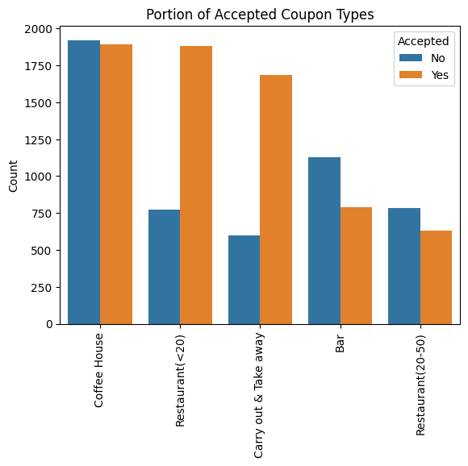
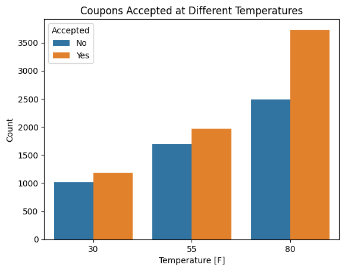
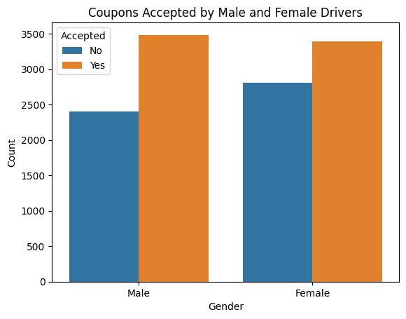
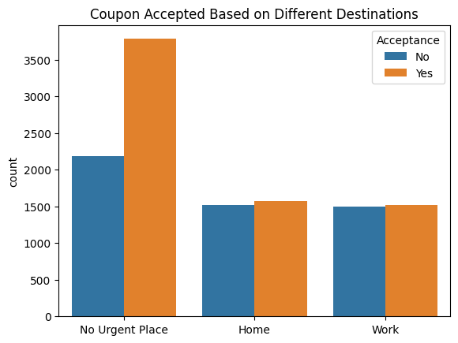

# Berkeley Haas - Professional Certificate in Machine Learning & Artificial Intelligence - Module 5 - Practical Application 1

## Will a Customer Accept the Coupon?

The data is from the UCI Machine Learning repository and was collected via a survey on Amazon Mechanical Turk. The survey describes different driving scenarios including the destination, current time, weather, passenger, etc., and then asks the person whether they will accept the coupon or not if they are the driver. There are five different types of coupons -- less expensive restaurants (under $20), coffee houses, carry out & take away, bar, and more expensive restaurants ($20 - $50). 

The aim of this analysis is to find out which factors impact the drivers’ decisions to accept the offered coupons.

## Data Analysis

Data cleaning and analysis were done in the following [Jupyter Notebook](prompt.ipynb) using Python, Pandas, Seaborn, Matplotlib, and numpy.

### Overview of Data

The most accepted types of coupons were for lower-priced restaurants or take-away orders, while bar coupons were the ones that were most rejected. Higher outside temperatures increased coupon acceptance rates.

### Investigating the Acceptance of Bar Coupons

The data analysis yielded the following results about bar coupons:
- Only 41 % of people who were offered a coupon for a bar accepted it.
- Drivers who visit bars more than four times per month accepted bar coupons in 76 % of the cases, while drivers who visit bars less often only accepted in 37 % of cases.
- Drivers over 25 who go to a bar more than once a month are approx. 1.78 times as likely to accept a bar coupon as all other drivers.
- Drivers who go to a bar more than once a month, had a passenger who was not a child, and who do not work in farming, fishing or forestry accepted 71 % of bar coupons.
- Drivers who go to a bar more than once a month, had passengers who were not children, and were not widowed accepted 71 % of bar coupons.
- Drivers who go to a bar more than once a month, and are under 30 accepted 72 % of bar coupons.
- Drivers who go to a cheap restaurant more than four times a month, and whose income is less than 50k accepted 46 % of bar coupons.

In summary, bar coupons are the least popular coupons. Passengers are more likely to accept bar coupons if they are under 30 years old, go to bars more than once a month and have other passengers who are not children.

### Male vs. Female Drivers

Male drivers are more likely to accept coupons.

### Destination of the Drivers

Drivers who are headed to a non-urgent destination are most likely to accept a coupon.

Male drivers are approx. as likely as female drivers to accept coupons during a leisurely drive.

## Outlook

Other interesting factors to analyze would be if the expiration time of the coupons also played a role in acceptance and how many coupons would actually lead to a visit to the places that offered them.
